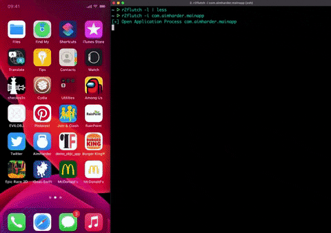

# r2flutch
Yet another tool to decrypt iOS apps using r2frida.




## Requirements

It requires to install Frida on the Jailbroken iOS device:

 * Jailbroken device
 * Frida installed on the device. (e.g. via Cydia) https://frida.re/docs/ios/#with-jailbreak
 * radare2 installed. https://github.com/radareorg/radare2
 * r2frida installed. https://github.com/nowsecure/r2frida


## Installation

* Using PIP:

```
pip install r2flutch
```

* Using r2pm:

```
r2pm -ci r2flutch
```

## Usage

* Run `r2flutch -l` to list all the installed apps.


* Run `r2flutch -i <App Bundle>` to pull a decrypted IPA from the device.


* Run `r2flutch <App Bundle>` to pull the decrypted app binary from the device.


## Troubleshooting

### Issue #1: Xcode isn't open.
> error: This feature requires an iOS Developer Disk Image to be mounted; run Xcode briefly or use ideviceimagemounter to mount one manually
Cannot spawn: This feature requires an iOS Developer Disk Image to be mounted; run Xcode briefly or use ideviceimagemounter to mount one manually

Solution: Run Xcode

### Issue #2: Gadget isn't installed
> error: Cannot attach: Need Gadget to attach on jailed iOS; its default location is: /Users/mak/.cache/frida/gadget-ios.dylib

Solution: 2 steps
1. Visit https://github.com/frida/frida/releases
2. download and extract (gunzip)  i.e: we'll do this for frida-gadget-15.1.10-ios-universal.dylib.gz but make sure to get the latest
 * `curl -L https://github.com/frida/frida/releases/download/15.1.10/frida-gadget-15.1.10-ios-universal.dylib.gz -o frida-gadget-15.1.10-ios-universal.dylib.gz`
 * `gunzip frida-gadget-15.1.10-ios-universal.dylib.gz`
 * `mkdir -p ~/.cache/frida`
 * `mv frida-gadget-15.1.10-ios-universal.dylib ~/.cache/frida/gadget-ios.dylib`
