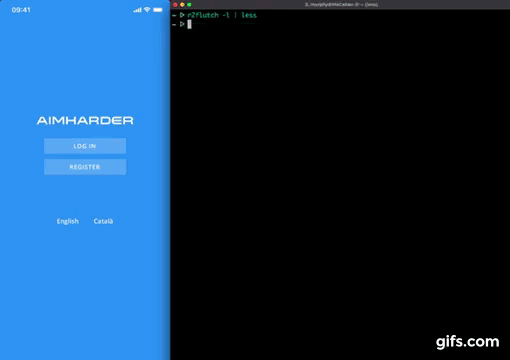
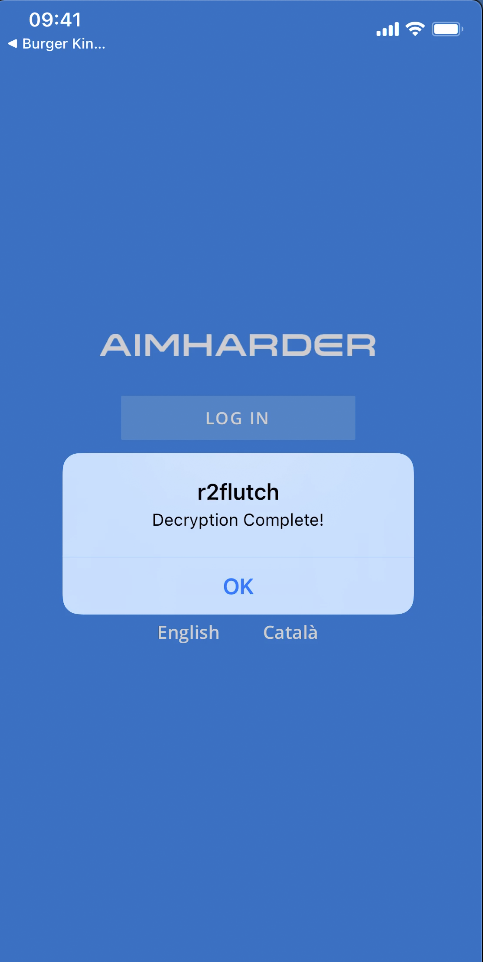
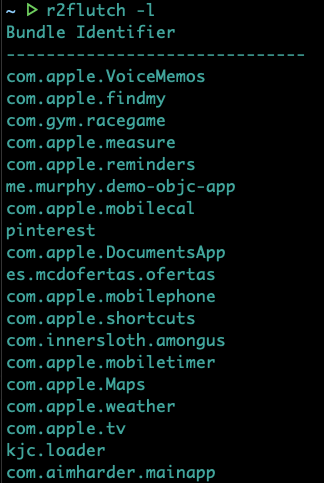
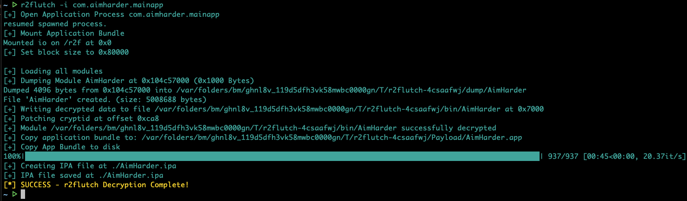

# r2flutch
Yet another tool to decrypt iOS apps using r2frida.





## Requirements

It requires to install Frida on the Jailbroken iOS device:

 * Jailbroken device
 * Frida installed on the device. (e.g. via Cydia) https://frida.re/docs/ios/#with-jailbreak
 * radare2 installed. https://github.com/radareorg/radare2


## Installation

* Using PIP:

```
pip install r2flutch
```

* Using r2pm

```
r2pm -ci r2flutch
```

## Usage

* Run `r2flutch -l` to list all the installed apps.




* Run `r2flutch -i <App Bundle>` to pull a decrypted IPA from the device.



* Run `r2flutch <App Bundle>` to pull the decrypted app binary from the device.
