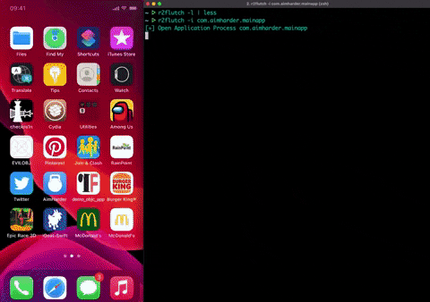
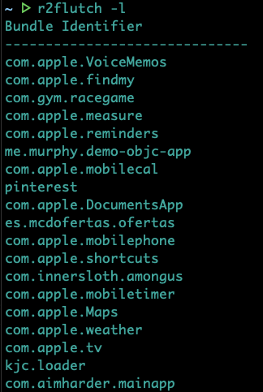
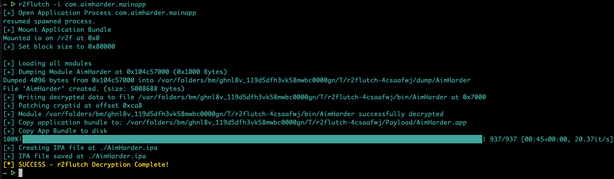
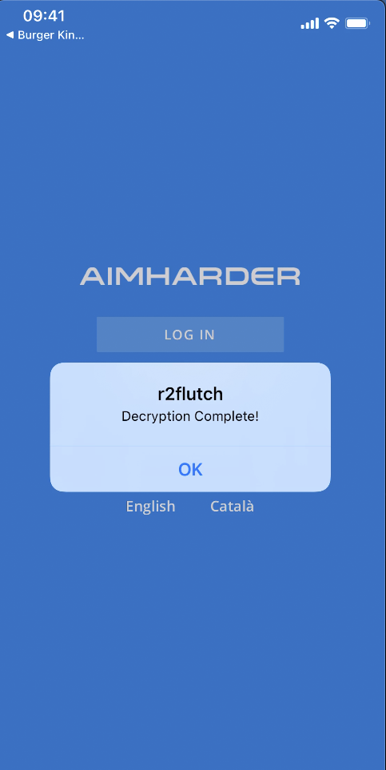

# r2flutch
Yet another tool to decrypt iOS apps using r2frida.




## Requirements

It requires to install Frida on the Jailbroken iOS device:

 * Jailbroken device
 * Frida installed on the device. (e.g. via Cydia) https://frida.re/docs/ios/#with-jailbreak
 * radare2 installed. https://github.com/radareorg/radare2
 * r2frida installed. https://github.com/nowsecure/r2frida


## Installation

* Using PIP:

```
pip install r2flutch
```

* Using r2pm:

```
r2pm -ci r2flutch
```

## Usage

* Run `r2flutch -l` to list all the installed apps.




* Run `r2flutch -i <App Bundle>` to pull a decrypted IPA from the device.



* Run `r2flutch <App Bundle>` to pull the decrypted app binary from the device.



### File Transfer Transport

r2flutch supports two transport modes for downloading files from the device:

| Flag | Transport | Description |
|------|-----------|-------------|
| `-t ssh` | **SSH (default)** | Downloads files over SFTP. Faster and more reliable for large bundles. |
| `-t frida` | Frida | Downloads files through r2frida commands (original behavior). |

#### SSH Transport (default)

SSH transport requires a `config.json` file with the device credentials:

```json
{
    "ssh": {
        "host": "192.168.1.100",
        "port": 22,
        "username": "root",
        "password": "alpine"
    }
}
```

The fields `host`, `username` and `password` are **required**. `port` defaults to `22` if omitted.

By default r2flutch looks for `config.json` in the current directory. Use `-c` to specify a custom path:

```
r2flutch -c /path/to/config.json -i com.example.app
```

#### Frida Transport

To use the original Frida-based file transfer (no config file needed):

```
r2flutch -t frida -i com.example.app
```

### All Options

```
usage: r2flutch [-h] [-d] [-o OUTPUT] [-i] [-l] [-t {ssh,frida}] [-c CONFIG] [target]

r2flutch (by Murphy)

positional arguments:
  target                          Bundle identifier of the target app

options:
  -h, --help                      show this help message and exit
  -d, --debug                     Show debug messages
  -o OUTPUT, --output OUTPUT      Path where output files will be stored.
  -i, --ipa                       Generate an IPA file
  -l, --list                      List the installed apps
  -t {ssh,frida}, --transport     Transport for file transfer: ssh (default) or frida
  -c CONFIG, --config CONFIG      Path to config.json file (default: config.json)
```

## Testing

Run the test suite with coverage:

```bash
bash run_tests.sh
```

Or directly with pytest:

```bash
python3 -m pytest test/ -v
```

## Troubleshooting

### Issue #1: Xcode isn't open.
> error: This feature requires an iOS Developer Disk Image to be mounted; run Xcode briefly or use ideviceimagemounter to mount one manually
Cannot spawn: This feature requires an iOS Developer Disk Image to be mounted; run Xcode briefly or use ideviceimagemounter to mount one manually

Solution: Run Xcode

### Issue #2: Gadget isn't installed
> error: Cannot attach: Need Gadget to attach on jailed iOS; its default location is: /Users/mak/.cache/frida/gadget-ios.dylib

Solution: 2 steps
1. Visit https://github.com/frida/frida/releases
2. download and extract (gunzip)  i.e: we'll do this for frida-gadget-15.1.10-ios-universal.dylib.gz but make sure to get the latest
 * `curl -L https://github.com/frida/frida/releases/download/15.1.10/frida-gadget-15.1.10-ios-universal.dylib.gz -o frida-gadget-15.1.10-ios-universal.dylib.gz`
 * `gunzip frida-gadget-15.1.10-ios-universal.dylib.gz`
 * `mkdir -p ~/.cache/frida`
 * `mv frida-gadget-15.1.10-ios-universal.dylib ~/.cache/frida/gadget-ios.dylib`
